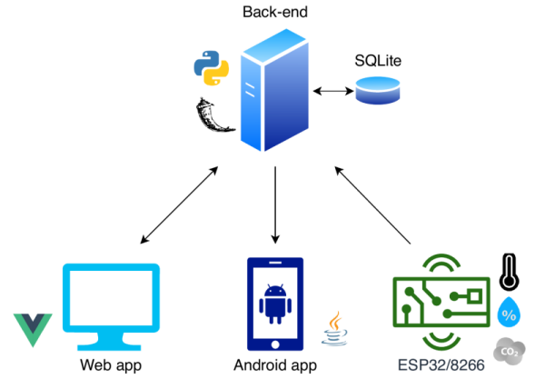
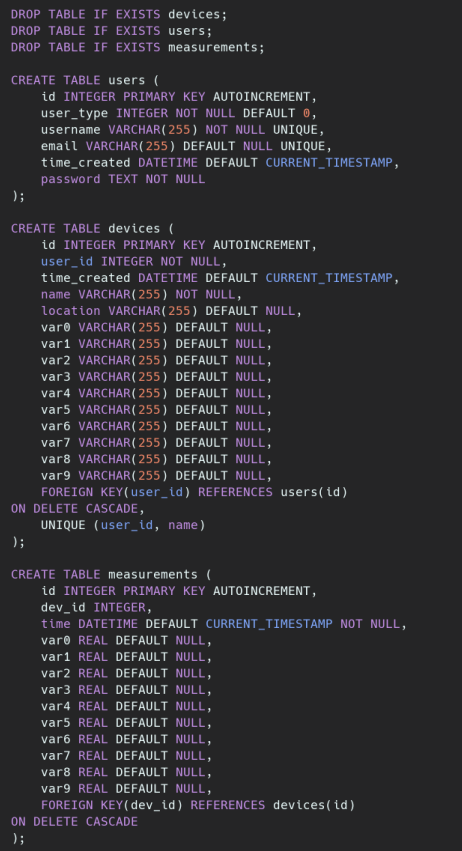
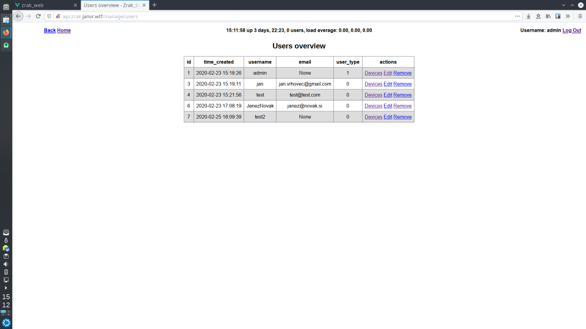
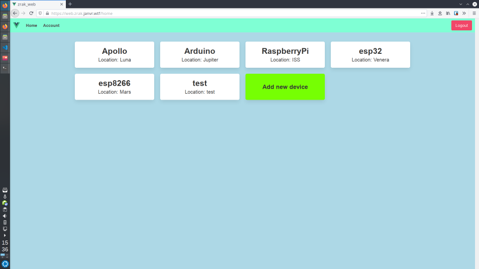
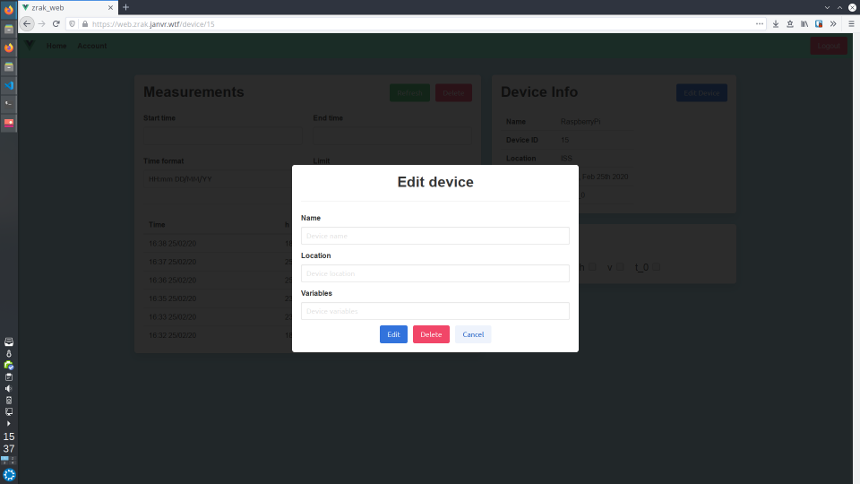
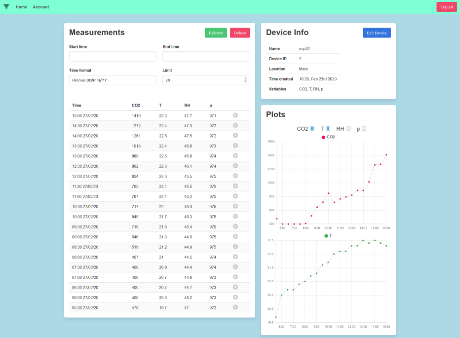
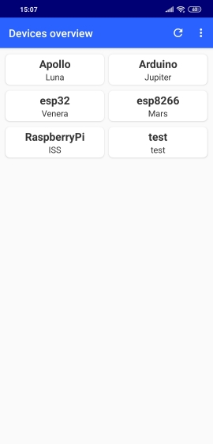
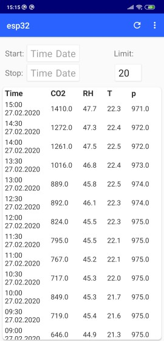

# Projekt Internet of Things platforma
#### Seminar iz načrtovanja in razvoja programske opreme v telekomunikacijah 2020
---
Projekt IoT platforma je sestavljen iz štirih delov - API strežnika, spletne aplikacije, mobilne aplikacije in knjižnice za uporabo na mikrokrmilnikih ESP.

Predvidena uporaba je sledeča:\
Uporabnik si najprej ustvari račun z uporabniškim imenom in geslom, ki se uporabljata za identifikacijo in avtorizacijo pri uporabi API zahtevkov. Nato uporabnik v sistemu ustvari napravo, ki ima svoje ime, lokacijo in spremenljivke. Ta naprava je lahko katerakoli stvar zmožna pošiljanja HTTP zahtevkov. Primer naprave, ki se lahko uporabi je zelo popularen in dostopen mikrokrmilnik ESP8266, ki ima že vgrajeno WiFi povezljivost. Ta naprava lahko nato odčituje razne senzorje in podatke o meritvah z uporabo API klica nalaga na strežnik. Uporabnik do teh meritev lahko dostopa preko spletne ali mobilne aplikacije.

---

## API strežnik
**Repozitorij:** https://github.com/janvr1/zrak_backend

API storitve je sestavljen iz treh končnih točk - endpoint-ov. To so `/users`, `/devices` in `/measurements`. Na vsako izmed končnih točk lahko pošiljemo zahtevek `GET`, `POST`, `PUT` ali `DELETE` preko katerih lahko prejemamo, dodajamo, spreminjamo ali pa izbrišemo podatke na strežniku. Na voljo je tudi admin vmesnik, preko katerega lahko administrator storitve upravlja z uporabniki, napravami in meritvami na strežniku. Podrobnejši opis se nahaja v repozitoriju.

### Screenshots
Struktura podatkovne baze:\
\
Admin vmesnik:\

---

## Spletna aplikacija
**Repozitorij:** https://github.com/janvr1/zrak_web

Spletna aplikacija omogoča dostop do vseh funkcionalnosti API-ja z izjemo dodajanja novih meritev. Uporabnik lahko preko aplikacije upravlja s svojim uporabniškim računom, dodaja/ureja/briše naprave, ki so vezane na njegov račun in pregleduje/briše meritve posameznih naprav.

### Screenshots
Pregled naprav:\
\
Urejanje naprave:\
\
Pregled meritev:\

---

## Mobilna aplikacija
**Repozitorij:** https://github.com/janvr1/zrak_android

Mobilna aplikacija je bolj preprosta od spletne aplikacije in omogoča dostop samo do `GET` funkcionalnosti API-ja - torej pregledovanje naprav in meritev ne pa tudi dodajanja/urejanje le-teh.

### Screenshots

---

## ESP knjižnica
**Repozitorij:** https://lkn7.fe.uni-lj.si/janvr/iot_esp_lib

Knjižnica je namenjena mikrokrmilnikom ESP8266 in ESP32 in omogoča preprosto pošiljanje meritev na strežnik (`POST`zahtevek na `/measurements`). Primer uporabe je na voljo v repozitoriju.
